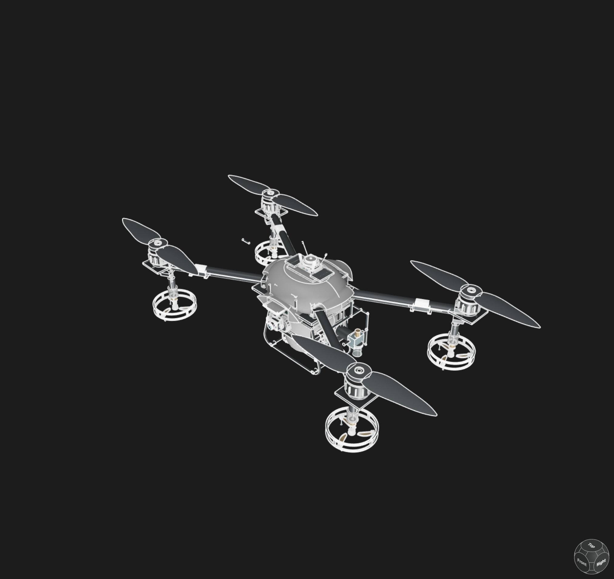
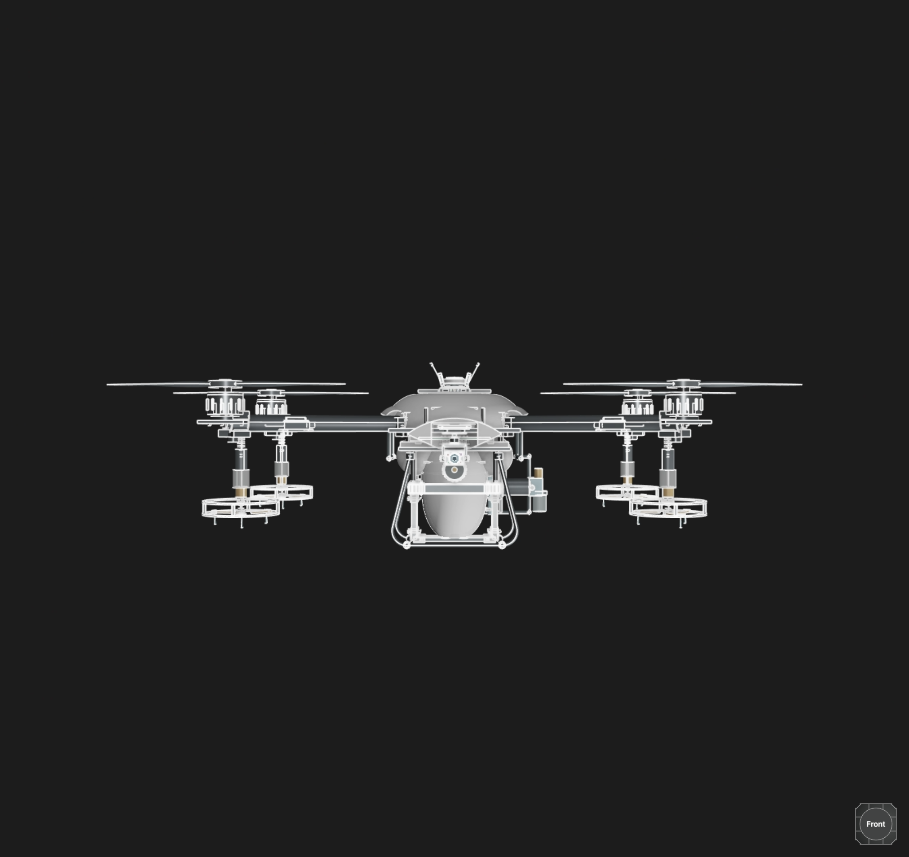
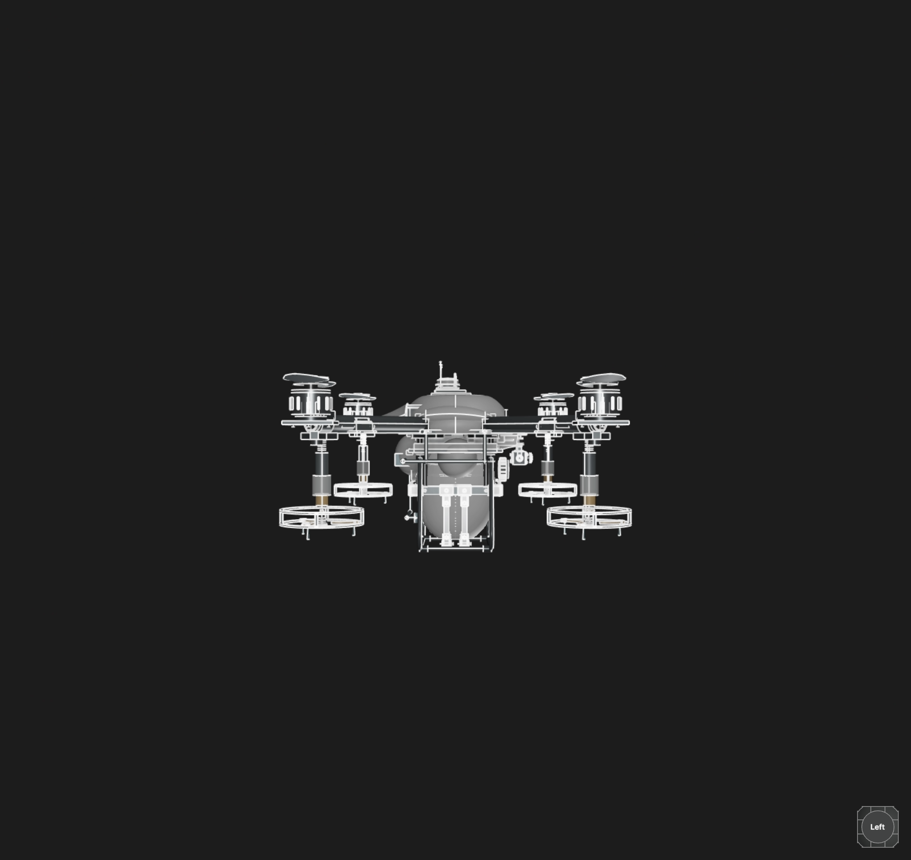

# Agrofloat

A parametric agricultural spray drone (quadcopter) built from scratch in KCL for the [Zoo API Makeathon](https://zoo.dev/events/api-makeathon).


## The problem

Crop spraying by hand or with ground rigs is slow and damages the crop. Commercial ag-drones are expensive, closed systems that farmers cannot modify or repair. Most open-source drone designs cover the airframe but skip the payload that makes the drone useful: the tank, pump, and spray plumbing.

## Why this solution

A single parametric reference design for an agricultural drone that anyone can open, tweak, and build. Every dimension is driven by exported parameters in `parameters.kcl` (rotor spacing, arm length, tube diameter, tank placement), so changing one value updates the whole assembly. It targets a real class of ag-drones (about 570 mm motor pitch) and includes the payload systems most open designs leave out: chemical tank, cap, cradle, pump, plumbing, and spray nozzles, plus navigation, camera, battery, and controller stacks.

## Screenshots

Configurator viewport renders:

| | |
| --- | --- |
|  |  |
|  | |

## How it works

A modular KCL project. `main.kcl` is the entry point. It imports each subsystem file, applies global transforms to assemble the aircraft, and exports one flattened `agriculturalDroneAssembly`:

| Subsystem | File | Notes |
| --- | --- | --- |
| Fuselage | `upperFuselageShell.kcl`, `lowerFuselageShell.kcl` | Two-shell clamshell body |
| Chassis | `chassisAssembly.kcl`, `chassisFastenerAssembly.kcl` | Central frame and fasteners |
| Propulsion | `quadArmAssembly.kcl`, `armClampPlacement.kcl`, `quadMotorAssembly.kcl`, `quadEscAssembly.kcl`, `quadPropellerAssembly.kcl` | Booms, clamps, motors, ESCs, props |
| Spray payload | `chemicalTank.kcl`, `tankCap.kcl`, `tankCradle.kcl`, `pumpModule.kcl`, `sprayPlumbing.kcl`, `quadNozzleAssembly.kcl` | Full spray path from tank to nozzle |
| Avionics | `navigationModule.kcl`, `cameraModule.kcl`, `controllerStack.kcl`, `batteryPack.kcl` | Nav, camera, flight controller, power |
| Landing | `landingGearAssembly.kcl` | Skids and crossbar |

It was authored in Zoo Design Studio using KCL with Studio's reference and measurement tools, and the full model is generated by the Zoo Engine.

## How the Zoo APIs were used

- **KCL (Zoo Design Studio and Engine)** - the whole model is parametric KCL built in Studio and rendered by the Zoo modeling engine. Shared datums and dimensions live in `parameters.kcl` and are exported and imported across modules.
- **Zoo Engine API** - the KCL is compiled and evaluated against the same Engine API that Zoo Design Studio uses, which produces the renderable, measurable, exportable geometry.
- **Open and remixable** - because the design is plain-text `.kcl`, anyone can remix it, rebuild it through the Engine API, or drive it programmatically with the Agent API.

## Setup and installation

1. Install [Zoo Design Studio](https://zoo.dev/design-studio) (the free tier is enough to open and edit this project).
2. Sign in to your Zoo account.
3. Clone this repository:

   ```sh
   git clone https://github.com/Priedins15/agro-drone-matador.git
   ```

4. Open the `agrofloat` folder in Zoo Design Studio (open `project.toml` or `main.kcl`).
5. Run `main.kcl` to regenerate the full `agriculturalDroneAssembly`.
6. Change dimensions in `parameters.kcl` and run again to see the changes propagate through the whole aircraft.

## Demo

Watch the walkthrough video:

<div>
  <a href="YOUR_DEMO_VIDEO_URL"></a>
</div>

> Add your 30 second to 5 minute demo video link above (upload it to this repo by editing `README.md` on GitHub and dragging the file in, or host it and paste the URL).

## Project structure

```
agrofloat/
├── main.kcl                 # Entry point: assembles and exports the drone
├── parameters.kcl           # Shared parametric datums and dimensions
├── project.toml             # Zoo project metadata (default file: main.kcl)
├── *Assembly.kcl            # Part- and sub-assembly-level modules
├── *.kcl                    # Individual part modules (tank, pump, motors, ...)
└── README.md
```

## License

Open source. Freely remix and build on it. See the Zoo [API Makeathon rules](https://zoo.dev/events/api-makeathon) for submission details.
