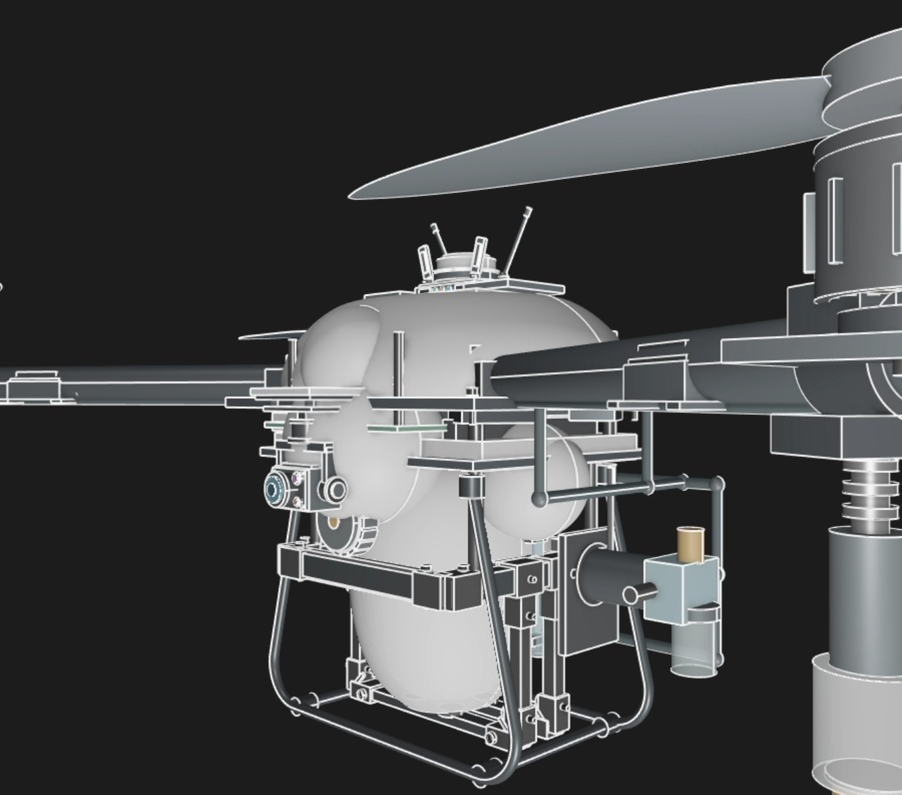

# Agrofloat

A fully parametric agricultural spray drone (quadcopter) designed from scratch in KCL, built for the [Zoo API Makeathon](https://zoo.dev/events/api-makeathon).



## The problem

Crop protection spraying by hand or with ground rigs is slow, labor-intensive, and damages the crop. Commercial ag-drones are expensive, closed hardware that farmers cannot modify or repair. Most hobby/maker drone designs only cover airframe basics and skip the actual payload — the tank, pump, and spray plumbing that make the drone useful in the field.

## Why this solution

I wanted a single, fully parametric reference design for an agricultural drone that a farmer or maker could open, tweak, and cut on their own machine. Everything is driven by exported parameters (`parameters.kcl`) — rotor datum, arm lengths, tube diameters, tank placement — so a size change in one place ripples through the whole assembly. The design targets a real class of ag-drones (~570 mm motor pitch) and includes the payload subsystems most open-source drones leave out: chemical tank + cap, cradle, pump module, plumbing, and spray nozzles, plus navigation/camera/battery/controller stacks.

## How it works

The project is written as a modular KCL project. `main.kcl` is the entry point that imports each subsystem file, applies global transforms to assemble the aircraft, and exports a single flattened `agriculturalDroneAssembly`:

| Subsystem | File | Notes |
| --- | --- | --- |
| Fuselage | `upperFuselageShell.kcl`, `lowerFuselageShell.kcl` | Two-shell clamshell body |
| Chassis | `chassisAssembly.kcl`, `chassisFastenerAssembly.kcl` | Central frame + fasteners |
| Propulsion | `quadArmAssembly.kcl`, `armClampPlacement.kcl`, `quadMotorAssembly.kcl`, `quadEscAssembly.kcl`, `quadPropellerAssembly.kcl` | Booms, clamps, motors, ESCs, props |
| Spray payload | `chemicalTank.kcl`, `tankCap.kcl`, `tankCradle.kcl`, `pumpModule.kcl`, `sprayPlumbing.kcl`, `quadNozzleAssembly.kcl` | Full spray path from tank to nozzle |
| Avionics | `navigationModule.kcl`, `cameraModule.kcl`, `controllerStack.kcl`, `batteryPack.kcl` | Nav, camera, flight controller, power |
| Landing | `landingGearAssembly.kcl` | Skids and crossbar |

It was authored in Zoo Design Studio using KCL with Studio's reference/measurement tools to match the intended drone geometry, and the full model is generated by the Zoo Engine.

## How the Zoo APIs were used

- **KCL (Zoo Design Studio / Engine)** — the entire model is parametric KCL built in Studio, rendered by the Zoo modeling engine. Shared datums and dimensions live in `parameters.kcl` and are exported/imported across modules.
- **Zoo Engine API** — KCL in this project is compiled and evaluated against the same Engine API used by Zoo Design Studio, which is what produces the renderable, measurable, exportable geometry.
- **Open, remixable source** — because the whole design is plain-text `.kcl`, anyone can remix it, rebuild it through the Engine API, or wrap it with the Agent API to drive the design programmatically.

## Setup and installation

1. Install [Zoo Design Studio](https://zoo.dev/design-studio) (free tier is enough to open and edit this project).
2. Sign in to your Zoo account.
3. Clone this repository:

   ```sh
   git clone https://github.com/Priedins15/agro-drone-matador.git
   ```

4. Open the `agrofloat` folder as a project in Zoo Design Studio (open `project.toml` / `main.kcl`).
5. `main.kcl` is the entry point — run it to regenerate the full `agriculturalDroneAssembly`.
6. Tweak dimensions in `parameters.kcl` and re-run to see the changes propagate through the whole aircraft.

## Demo

Watch the walkthrough video:

<div>
  <a href="YOUR_DEMO_VIDEO_URL"></a>
</div>

> Add your 30 second to 5 minute demo video link above (upload it to this repo by editing `README.md` on GitHub and dragging the file in, or host it and paste the URL).

## Project structure

```
agrofloat/
├── main.kcl                 # Entry point — assembles and exports the drone
├── parameters.kcl           # Shared parametric datums and dimensions
├── project.toml             # Zoo project metadata (default file: main.kcl)
├── *Assembly.kcl            # Part- and sub-assembly-level modules
├── *.kcl                    # Individual part modules (tank, pump, motors, …)
└── README.md
```

## License

Open source — freely remix and build on it. See the Zoo [API Makeathon rules](https://zoo.dev/events/api-makeathon) for submission details.
